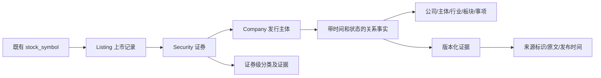

# 公司关系图谱增量实现与验收

本轮是在已有股票、研报、选股、知识图谱和资源管理之上增加公司关系工作台，不替换旧功能，也不把全部业务数据迁入新图。2026-09-21 已完成正式本地业务库增量迁移和 25 只真实证券导入；以下计数为本次验收快照，不代表全市场或全部来源覆盖。

正式入口为 http://127.0.0.1:5173 ，进入“数据中台 / 公司关系”，页面标识“正式本地业务库 · 25证券验收”，API 为 http://127.0.0.1:8000 。旧演示端口 5175/8011 和本轮副本端口 5176/8012 已关闭，验收副本、证据缓存和截图保留。

## 备份与保留边界

- 代码基线：`b769435`，远程备份分支 `backup/pre-company-graph-20260921-b769435` 已推送并核验。代码备份不包含被忽略的数据库、密钥或本地配置。
- 数据库备份：`backend/backups/pre-company-graph-20260921-b769435.db`；备份完整性检查通过，包含原有 19,165 条股票记录。
- 原有 50 张业务表通过逐行指纹对比检查保留情况，不以行数相等代替内容保留。新增资源登记只插入缺失代码，不覆盖用户已有数据源、接口、Agent、Skill 及其配置。
- 旧四个工作区、股票详情、行情采集、旧知识图谱、研报、选股盯盘和模型管理入口保留；公司关系通过新工作台及股票详情入口接入。研报增加可关闭的只读上下文，不改变原有模型选择。
- 最终副本：`backend/validation/company-graph-final-20260921.db`。正式库 `backend/quant.db` 独立执行同一增量迁移和导入，没有用副本覆盖正式库。服务恢复后的原有 50 表行指纹审计仍全部通过，完整性为 `ok`。

## 已实现的对象关系



| 对象或能力 | 本轮实现与限制 |
| --- | --- |
| Company / Security / Listing | 独立标识，引用旧 `stock_symbol.id`；同公司 A/H 证券可以合并发行主体，证券本身仍独立 |
| 来源身份 | 新增 `foundation_source_identity`，登记标识和供应商命名空间内的发行主体 ID 用于解析；不按公司名称相同自动合并 |
| 证券分类 | 新增 `foundation_security_classification`；行业、主题、类型和 SIZE 按维度、定义版本、方法、证据、有效期、审核记录保存，不把 A 股标签复制给 H 股 |
| 关系事实 | 复用基础层事实与审核模型，展示持股、行业、经营及司法等分组；关系有方向、主体、对象、时间和证据，不以普通连线代替事实契约 |
| 披露股东账户 | `HOLDER_ACCOUNT` 仅允许作为持股主体；不自动认定为公司、自然人、最终受益人或控制方 |
| 证据 | 内容哈希与不可覆盖版本；相同内容重复获取不因获取时间变化而重复创建事实；一份公告可以同时用于经营和司法披露 |
| 图谱查询 | 1 至 3 跳、最多 200 节点和 400 边；默认只读 `ACCEPTED`，可显式查看候选，保留证据、方向与截断标记 |
| 覆盖审计 | 区分已有、候选和未采集；固定样本分母包括未映射与原股票缺失，不能用“查不到”解释为“不存在” |

主要入口为 `/api/v1/company-graph`，包含状态、证券/公司检索、样本、公司档案、证券档案、子图、导入及分类审核。基础事实及人工审核继续使用 `/api/v1/foundation`。

## 来源、身份和时间边界

| 来源 | 已接入内容 | 不作出的承诺 |
| --- | --- | --- |
| 东方财富 | 公司资料、行业及主题信息、A 股前十大登记股东披露 | 聚合工商字段不等于官方工商核验；港股股东未实现，不补造数据 |
| 巨潮资讯 | A 股经营和司法公告、PDF 正文、页码与案号提及 | 非完整法院案件库；披露公司不必然是交易方或诉讼当事人；案号提及不是已解析案件结论 |
| 腾讯行情 | A 股人民币供应商市值快照和可追溯 SIZE 规则 | 不是交易所认证口径，不与 H 股市值相加，不宣称全市场分位分类 |
| 工商官方、法院司法全量源 | 登记为禁用、待授权的参考来源 | 未获取访问或数据授权前不执行批量查询，不绕过访问限制 |

公开可访问不等于获得无限量抓取、商业再分发或长期存储许可；本轮仅有限样本采集。扩大范围前仍须确认来源条款、访问配额和用途。来源失败、空结果、未请求、未支持和待授权分别报告。

身份消歧保留命名空间、登记体系和司法辖区；登记标识冲突或辖区冲突阻止合并。公司档案读取最新证据快照，不通过覆盖主体信息抹去历史。

业务有效期与系统获知时间分别处理，日期区间采用左闭右开。`as_of` 用于业务日期，`known_at` 约束系统记录、证据可获知时间与当时审核状态。默认档案覆盖为 `ALL_RECORDED_PERIODS`，不是“今天仍全部有效”；指定日期时才为 `BUSINESS_DATE_FILTERED`。

股东报告期只形成报告日观察，不向后推定持仓持续；来源只有当前资料快照而无持仓基准日时标记 `SOURCE_SNAPSHOT_UNKNOWN_BUSINESS_DATE`，不进入当前研报持股上下文。公告的经营/司法用途也保存记录时间，后来补充的用途不能泄露到更早的 `known_at` 查询。

SIZE 使用 `CNY_MARKET_CAP_ABSOLUTE_V1`：人民币市值不低于 1000 亿元为大盘，200 亿元至不足 1000 亿元为中盘，不足 200 亿元为小盘。采用腾讯字段 45 的供应商市值，即 A 股价格乘发行主体总股本口径，不等同于 A 股上市类别市值。有效期是快照中国本地日期至次日，不是获取日。港股币种及股本口径未核实，当前不生成 SIZE；蓝筹、红筹等也不能由名称或这套市值阈值推断。

## 治理与研报使用

登记的总 Agent 为 `COMPANY_GRAPH_GOVERNOR`，关联四个有版本的 Skill：`COMPANY_MASTER_RESOLVER`、`COMPANY_DISCLOSURE_ARCHIVER`、`COMPANY_RELATION_NORMALIZER`、`COMPANY_COVERAGE_AUDITOR`。实际执行入口是 `company_graph_governance` 工作流，不是向 Agent 聊天即自动执行采集。

本轮采集、归一化、身份映射、分类和候选生成不调用 LLM。结构化来源事实可在显式 `accept_structured` 选项下按受限规则接受；默认仍为待审核。控制、司法结论、经营交易主体等语义候选不因开启此选项自动接受。`ACCEPTED` 表示通过系统约束及相应审核，不等于权威机关对客观真实性的认证。

研报只读当前有效、当前已知的已接受事实，最多取 20 条并标记截断；候选司法/经营关系与持仓基准日未知的快照不进入该事实列表。未映射、未初始化或读库异常时原研报继续。现有研报功能仍可按用户原配置调用模型，不属于本次无 LLM 的数据治理链。

## 固定真实样本

批次为 `company-graph-20260921`，固定 25 只证券，代码保留前导零：

- A 股 20 只：`000001,000333,000725,000858,002594,300750,600028,600030,600036,600104,600221,600276,600519,600900,601318,601398,601668,601766,601857,601899`。
- 港股 5 只：`02318,03968,01211,02899,01398`。

本批没有新三板真实采集验收，不表示删除原新三板功能。A/H 配对依据来源身份而非股票简称；成功映射为 25 证券、20 公司，不应要求不同证券必然对应不同公司。

正式库验收快照：224 个主体、219 条已接受事实及 1 条候选、595 条证券分类、81 份独立证据。其中东方财富 45 份、腾讯 20 份、巨潮 16 份（司法 3、经营 13）。20 份市值为 2026-09-18 快照，19 只大盘、海航控股 `600221` 为 535.87 亿元中盘；不是 2026-09-21 当日实时市值。证据引用次数与独立证据数量是不同指标，不相加。

这些计数不代表上下游、实际控制人、司法结论或全部历史已经覆盖。公司治理任务本身完成也不等于来源完整，应同时检查结果中的 `source_status`、逐来源状态、候选数量和覆盖缺口。

## 迁移与执行

独立 Alembic 版本为 `foundation_0002`，版本表 `foundation_schema_revision`。0001 的七张冻结表不重写；0002 仅新增来源身份、证券分类两张表。旧业务表不交由该迁移管理。既有 `create_all` 结构必须逐项验证后才能采用，结构漂移返回 `BLOCKED`，不盲目登记版本，不提供破坏性降级。完整说明见 [迁移文档](data-foundation-migration.md)。

以下命令均从 `backend` 目录运行，显式目标为已经存在的验收副本。正式库操作必须另行核对备份并安排停写窗口，不把示例路径静默替换成默认业务库。

```powershell
$companyAcceptanceDb = 'sqlite:///C:/工作/AI开发/gemini-quant-agent/backend/validation/company-graph-final-20260921.db'
python scripts/migrate_foundation.py preview
python scripts/migrate_foundation.py check --database-url $companyAcceptanceDb
python scripts/migrate_foundation.py apply --database-url $companyAcceptanceDb
python scripts/migrate_foundation.py check --database-url $companyAcceptanceDb
```

原有数据保留检查为只读操作，目标路径必须明确：

```powershell
python scripts/verify_company_preservation.py --baseline backups/pre-company-graph-20260921-b769435.db --current validation/company-graph-final-20260921.db
```

同步复验可先采集到新缓存目录，再显式导入；采集脚本不连接数据库，导入脚本写入目标库并保存运行记录。`--accept-structured` 是显式选择，省略时不自动接受结构化候选：

```powershell
python scripts/collect_company_sources.py --cache-dir validation/company-sources-rerun --section all --max-documents 2
python scripts/import_company_sources.py --database-url $companyAcceptanceDb --cache-dir validation/company-sources-rerun --accept-structured
```

工作台异步治理通过 `POST /api/v1/company-governance/jobs` 入队，最多 30 只证券。使用当前数据库中的 `stock_symbol_ids`，请求还包括 `request_key`、`include_holders`、`include_legal`、`include_business`、`include_marketcap` 和 `accept_structured`；不要跨数据库复制内部 ID。重复相同请求键及内容使用幂等任务，新的独立采集使用新请求键。`GET /api/v1/company-governance/jobs/{id}` 查询进度与结果。

API 进程不自动运行 worker。只启动 API 会让任务停留在待执行状态。公司专用 worker 应指向与 API 相同的已确认数据库，并只领取公司治理任务：

```powershell
$env:DATABASE_URL = $companyAcceptanceDb
python -m app.jobs.worker --task-type company_graph_governance --lease-seconds 3600
```

调试时只尝试领取一项符合类型的到期任务：

```powershell
python -m app.jobs.worker --task-type company_graph_governance --lease-seconds 3600 --once
```

`--once` 最多执行一项，不清空队列、不等待未来到期任务；是否成功须查看任务状态，进程退出不代表所有来源成功。`--task-type` 可以重复指定，未知类型在初始化前拒绝；不给过滤参数仍保持原全局 worker 行为，会处理该库其他到期任务，因此不应为验收公司功能而直接运行无参数 worker。

worker 启动仍会调用原数据库初始化（不播种默认资源），不是只读命令，应在迁移核验后运行。部署保持一个公司专用 worker，避免再启动不受限 worker 与其竞争。3600 秒租约比默认 900 秒更适合有限采集，但现有 worker 没有租约续期或 SQLite 多进程原子领取保证；不得把它解释为任意并发下的严格单次执行，超长任务仍须监测和受控重试。

## 开关回退

先停止公司专用 worker，再将对应 API 进程的配置设为：

```powershell
$env:DATA_FOUNDATION_ENABLED = 'false'
$env:COMPANY_RESEARCH_CONTEXT_ENABLED = 'false'
```

重启相应进程后生效，因为设置会缓存。只停用研报上下文时，仅设置第二个开关即可保留公司工作台。旧业务 API 不因该开关被移除。

开关不删除新表、不回滚迁移、不自动取消已经入队的任务，也不清除证据；原启动 `create_all` 仍可能创建缺失新表。代码版本回退可以保留新增表。数据库恢复须另行选择确定的备份并停写，不能把恢复旧快照当作没有数据损失的普通开关操作。

## 验证快照与剩余缺口

最终完整后端回归 **251 项通过、2 项子测试通过**，前端生产构建通过。复验命令如下：

正式浏览器 **16/16 场景通过**，覆盖桌面 1440 和手机 390 像素、25 样本、双对象切换、A/H 分类隔离、原股票详情、原智能体与 Skills、来源状态和证据页码；没有 JS、console 或 API 错误，没有页面横向溢出。原股票详情自动远程刷新在验收浏览器内改写为本地读取 2 次，未修改产品行为或调用付费模型。报告为 `backend/validation/screenshots/production/production-browser-report.json`，同目录保留截图。

```powershell
$env:DATABASE_URL = 'sqlite://'
$env:PYTHONDONTWRITEBYTECODE = '1'
python -m pytest -p no:cacheprovider -q
```

测试使用隔离内存或临时库；迁移覆盖旧表保留、0001 升级、结构漂移拒绝及幂等。worker 覆盖其他任务的待执行、重试和过期租约均不被领取、未知类型拒绝、单次执行及默认循环兼容。正式 HTTP 验收共 **403 项断言通过**，包含 25 证券双对象查询、5 组 A/H 同主体、持股方向、证据正文哈希、来源授权边界和规模分类快照。副本中还执行了真实单股治理任务，重复提交复用同一任务，执行 1 次完成，未调用付费模型。相同原始数据重复导入，主体、事实、证据和分类数量保持不变。PostgreSQL 仅有离线迁移 SQL 检查，尚无真实实例上线验证。

验收报告保存在 `backend/validation/production-http-acceptance.json` 和 `production-preservation.json`；该目录不提交到 Git。原有来源 8 条、接口 26 条、Agent 7 条和 Skill 11 条逐行未变，本轮分别追加 6、5、1、4 条，原股票仍为 19,165 条。正式 API 禁用启动默认资源重播（`SEED_DEFAULTS_ON_STARTUP=false`），独立公司 worker 只消费公司治理任务。后台进程不是 Windows 自启动服务，重启电脑后需按文档重新启动。

正式库来源覆盖仍为 `PARTIAL`：港股股东和市值尚未支持，贵州茅台本次司法源获取失败；其余空检索也不能视为无司法事项。完整工商登记、法院案件与受益所有人核验仍待合法授权。

建议依次验证 `000001` 的平安持股路径及基准日未知标识、`601318/02318` 的同公司多证券和分类隔离、`600221` 的司法原文页码、`601766` 的经营公告证据。市值分类应查看 `2026-09-18` 快照，不能当作今天实时市值。

- 尚无已授权的完整工商登记、最终受益人及法院案件库；披露账户身份、子公司当事人、控制关系和司法程序仍需进一步解析审核。
- 供应链完整关系、行业层级标准化、板块上下游聚合、产品材料节点连接尚未构成完整生产图谱，不根据同板块自动生成公司交易关系。
- 蓝筹、红筹、全市场市值分位与港股 SIZE 尚未实现；本轮绝对阈值样本不能外推为全市场分类。
- 本期不宣称解决证券代码历史复用、发行主体迁移、完整别名消歧、图谱发布版本或全部跨来源冲突处理。
- 新闻、量价、财务、股东行为等旧功能保留，但尚未全部迁为统一动态事实层；图谱也没有证明价格因果或执行投资预测。
- 当前为本机工作台，不新增多人认证、租户隔离或经过认证的审核人身份；不应直接暴露到公网。大规模采集前须再验证授权、配额、存储、幂等及并发任务能力。
