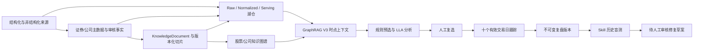

# 数据、主数据、知识与选股闭环实施说明

更新日期：2026-09-25

## 1. 已落地的主链路

本轮采用增量扩展，不替换已有数据源、股票数据、公司关系、模型、智能体、Skill、知识库或历史图谱。



统一知识管道为 `POST /api/v1/knowledge-pipeline/run`，依次记录身份解析、质量门禁、Agent + Skill 来源治理、湖仓发布、文档切片、图谱投影和统一血缘。每个阶段写入 `pipeline_run` 与 `pipeline_stage_run`。

## 2. 对象分层

| 层级 | 当前对象 | 当前实现口径 |
| --- | --- | --- |
| 证券主图谱 | Security、Company、Listing | 公司与证券分离，使用 `market:symbol` 规范证券标识，通过 Listing 和 `ISSUED_BY` 连接发行主体 |
| 分类主数据 | Industry、Theme/Sector、ClassificationTag | 分类定义保留名称、真实释义、体系版本、来源和有效期；证券分类保留证据与审核状态 |
| 公司关系事实 | 股权、控制、供应链、合作、合同、担保、借贷、司法事项 | 使用带有效期、属性、证据和审核状态的 `FoundationFact`；披露线索不自动升级为已验证事实 |
| 动态事实 | 财务、量价、实时行情、F10/股东、异常事件 | GraphRAG 直接读取结构化观测；图谱仅表达确定性事实或规则检测，不把异动解释为因果 |
| 非结构化证据 | 新闻、公告、财报、F10、研报、公司披露 | 原文形成 KnowledgeDocument，Raw 层归档，切片保留来源偏移、解析器与向量版本 |
| 发布与推理 | KnowledgeGraph、LakeDatasetVersion、GraphRAG | 图谱、湖仓版本、切片、结构化记录和血缘共同形成有界的时点上下文 |

模型抽取只能形成候选。`PENDING/CANDIDATE` 必须经来源校验或人工审核后才能成为 `ACCEPTED/VERIFIED`；模型置信度不能替代来源可信度。

## 3. 治理与构建顺序

1. 解析 Security、Company、Listing，未映射身份使管道保持 `PARTIAL`。
2. 建立行业、板块主题和类型标签主数据及真实释义。
3. 导入股权、控制、供应链、经营和司法证据；候选事实保持待审核。
4. 标准化财务、估值、量价和实时行情观测。
5. 通过确定性规则生成量价异常，不生成未经证据支持的原因。
6. 治理 F10、股东和公司行为资料。
7. 归档新闻、公告、政策和产业链原文，执行结构化切片。
8. 执行质量、重复、冲突、时点和覆盖检查。
9. 发布湖仓版本及独立图谱投影；图谱完成治理后才能供真实模型选股。

图谱投影默认每只证券、每个来源最多物化 50 篇文档，避免多年日线逐条铺满图谱。可通过 `graph_documents_per_stock` 调整或设为 `null`，但完整运行必须评估 SQLite、对象存储和图谱关系数量。

## 4. 知识管道调用

```json
{
  "market": "CN_A",
  "symbols": ["000001", "000002"],
  "export_lakehouse": true,
  "archive_chunks": true,
  "run_graph": true,
  "run_agent_governance": true,
  "include_company_tables": true,
  "graph_documents_per_stock": 50,
  "chunk_document_limit": 10000,
  "idempotency_key": "cn-a-demo-20260925-v1"
}
```

相同幂等键只能复用完全相同的规范化请求；不同范围或参数会返回 `409`。切片选择先保证每只证券的最新资料，再补关系证据并按来源轮询。覆盖报告分别给出：

- 被选中切片的文档比例；
- 被覆盖的证券比例；
- 有当前有效切片的文档比例；
- 真正进入本次模型上下文的文档比例。

空文档范围返回 `NO_DOCUMENTS` 和空覆盖率，不再显示为 100%。

## 5. 选股、跟踪、复盘与修复

真实模型只接收硬规则筛出的有限候选和 GraphRAG V3 上下文。上下文按选股运行的 `as_of` 截断文档、图谱关系、审核事实、结构化行情、切片、湖仓版本和血缘，防止复盘引用事后数据。

人工确认后保存不可变决策快照；跟踪只使用确认日之后已经收盘的十个有效交易日。每次复盘新增版本，不覆盖旧结论。

存在方向偏离、目标未达或触发止损时，可调用：

```text
POST /api/v1/skill-evaluations/retrospectives/{retrospective_id}/repair-flow
```

系统把当时可见的决策和证据转换为历史盲测用例，未来收益只用于评分，不进入模型输入。历史失败可请求真实元评审模型生成修复草案；Mock 不生成草案。草案固定为 `PENDING_REVIEW`，须在模型实验室人工审核，绝不自动改写或启用 Skill。修复后的 Skill 只有重新运行历史盲测并通过，才能证明该案例得到改善。

## 6. 状态门禁

`COMPLETED` 仅表示所有已请求阶段通过；身份未映射、质量失败、导出跳过、无知识文档、切片失败、图谱构建失败或图谱待治理都会返回 `PARTIAL` 并列出 `completion.issues`。

`completion.model_selection_ready=true` 还要求所选图谱为 `GOVERNED/LOCKED`，且本次已请求的数据身份、质量、湖仓和切片门禁均无问题。新建投影图默认为 `PENDING`，不能直接调用真实模型。

## 7. 当前真实数据边界

截至 2026-09-25，主库是可演进 MVP，不是全市场完成态：

| 项目 | 主库现状 |
| --- | ---: |
| 证券主数据 | 19,176 |
| 公司主体 | 14,009 |
| 港股股票公司映射 | 2,808 / 7,710 |
| 行业实体 | 46 |
| 分类定义 / 证券分类 | 10 / 678 |
| 已接受持股事实 | 159 |
| 控制事实 | 1 条，仍待审核 |
| 已验证供应链事实 | 0 |
| 已验证司法事项 | 0 |
| 外部上下文事件 | 0 |

供应链、经营和司法已有数据模型、公开披露证据与候选治理入口，但公开公告中的提及不能等同真实交易对手或已判决责任。要提升选股解释力，下一阶段的数据优先级应是港股公司映射、行业/主题标准主数据、官方股权披露，以及经授权或人工复核的供应链和司法事实。

## 8. 技术边界

- `HASH_EMBED_V1` 是可复现哈希向量，不是真正语义 Embedding；当前召回更接近可追溯有界上下文。
- SQLite + MinIO + Parquet 适合当前单机 MVP；并发写入、亿级行情或大规模向量召回达到阈值后再迁移 PostgreSQL、Iceberg/Delta 和专用向量索引。
- LakeObject 按内容哈希保存物理对象；同一内容在不同层和来源的归属记录在 `logical_bindings`，数据集版本和血缘记录保存本次发布范围。
- 真实 LLA 效果取决于已配置且可用的非模拟模型，Mock 仅验证契约和失败门禁。
