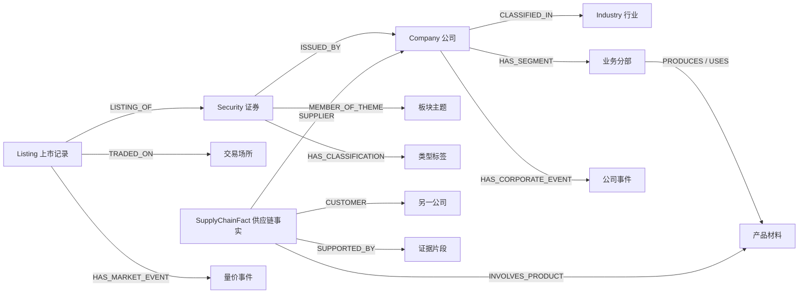
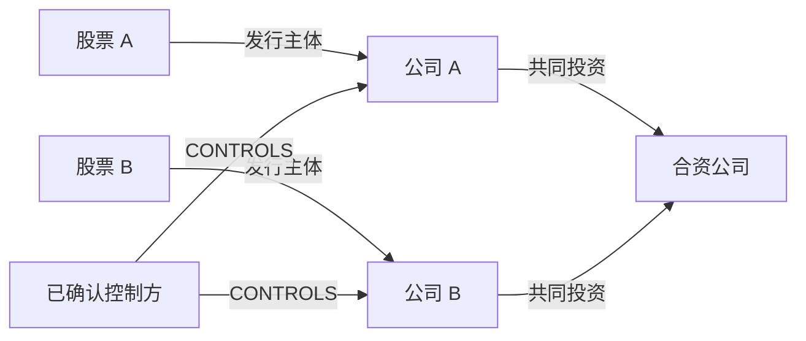

# 股票知识图谱架构设计草案

- 日期：2026-09-20。
- 状态：讨论稿，尚未实施，不代表当前系统已有这些能力。
- 范围：先定义证券、公司、股权控制、行业、板块、类型和产业链骨架，再定义动态事实、证据和治理契约。
- 本轮不包含：数据源选型、数据库迁移、Skill 编写、Agent 开发及模型调用。
- 设计基础：金融主数据管理、分类体系版本化、带证据的事实、双时态及信息可获知时间、可重建的图查询投影。
- 配套设计：[主数据、基础数据、关系与数据源方案](master-data-relations-and-sources.md)，细化公司身份、股权、经济往来、司法信息及来源验证。

## 1. 总体结构

用户从股票进入图谱，可以回答：它由哪家公司发行、在哪交易、由谁持股或控制、对外投资哪些主体、经营什么业务、属于哪些行业和板块、在何种规则下是什么类型，以及与哪些公司或产业环节存在上下游联系。每个答案都能解释其时间、口径、依据与审核状态。

采用三层业务模型和两项贯穿机制：

| 层次 | 内容 | 用途 |
| --- | --- | --- |
| 主体与分类层 | 公司、证券、上市记录、行业、板块主题、类型定义、产品和产业环节 | 建立可复用的对象骨架 |
| 关系与事实层 | 分类归属、股权、供应链、财务观测、量价摘要、公司及外部事件 | 表达在指定条件与时间内成立的关系或观测 |
| 证据层 | 来源、文档版本、证据片段、来源断言 | 支持追溯、复核与更正 |
| 时间与版本机制 | 业务有效期、信息可获知时间、系统记录期、发布版本 | 历史查询、回测、修订与重放 |
| 治理与权限机制 | 实体解析、规则版本、冲突、审核、覆盖及访问范围 | 决定哪些内容能进入可用图谱 |

主体结构也有历史：上市安排、行业归属、主题名单、类型、控制与供应链关系不能永久写死。

简单边是方便理解和查询的表示；行业、类型和供应链等业务关系，由带版本的事实支持。图不是只存主谓宾的无来源连线。

## 2. 主体对象与身份

| 对象 | 定义 | 身份规则 |
| --- | --- | --- |
| Company | 法律实体；法定名称、注册地区、主体类型、登记标识 | 永久内部 company_id；统一社会信用代码、LEI 等作为可选外部标识 |
| Security | 发行的证券工具或股份类别；发行主体、工具类型、权利特征 | 永久内部 security_id；不要求外部标识必须完整 |
| Listing | 证券在交易场所的交易安排；交易板、代码、币种、上市和终止时间 | 永久内部 listing_id；同场所同代码的有效区间不能重叠绑定不同上市记录 |
| TradingVenue | 交易所或交易场所；另外区分交易板和市场分组 | 规范内部 ID，可映射 MIC 等编码 |
| Person | 自然人股东、高管等，按披露及权限范围使用 | 内部 ID；不能按姓名直接合并 |
| Organization | 非公司机构，如国资监管机构、事业单位 | 与 Company 共用主体注册及外部标识机制，不把同一主体重复登记 |
| InvestmentVehicle | 基金、信托等投资载体 | 与管理人、托管人分别识别；如载体已有公司法律身份，复用该身份并增加角色 |
| EntityGroup | 被来源明确描述的集团或主体集合 | 显式集团身份和成员关系，不等于某个法律实体 |
| AnonymousParty | 第一大供应商等未披露身份对象 | 以披露主体、报告版本、报告期、角色和序号限定作用域 |
| BusinessSegment | 公司在指定报告口径下的业务分部 | 绑定公司、分部定义及版本；不同口径不直接拼接 |

同一公司 A 股和 H 股通常是两个证券，分别关联上市记录。ADR/GDR 如后续接入，应作为独立工具，通过存托关系连接基础证券。新闻提及的集团和实际签合同的子公司必须分别识别。

代码和名称以 IdentifierAssignment、AliasAssignment 保存历史，包含标识体系、值、对象、有效期及证据。改名不改变证券 ID，代码复用不复活旧证券。转板时是否保留 Listing 由交易安排连续性规则决定；合并、分拆、借壳等用沿革和公司行动事实处理，不能只按名字推断身份连续。

规范身份在授权数据域 namespace_id 内复用；graph_id 定义展示或查询范围，不参与永久主体身份。不同知识库的证据仍执行各自访问权限。

## 3. 行业、板块、指数和类型

| 对象 | 例子 | 归属与版本要求 |
| --- | --- | --- |
| Industry | 某分类体系中的软件、电子、机械等 | 体系、提供者、版本、代码和层级；主要关联公司或业务分部 |
| Sector / Theme | 军工、科技、人工智能、机器人等投资板块或主题 | 保存定义、提供者及版本；明确成员是公司、证券还是上市记录 |
| Index | 股票指数 | 独立对象；成分关系保存生效期、权重及发布版本 |
| ClassificationTag | 大盘、小盘、蓝筹、红筹等类型值 | 从属于分类维度与定义版本，不能只存无定义自由文本 |

科技、军工可能分别出现在行业体系、服务商板块或自定义主题中，由定义决定其类型。不同提供者同名板块不自动合并；跨体系采用有依据的 EQUIVALENT_TO、BROADER_THAN、OVERLAPS_WITH 映射，名称相似只形成候选映射。

行业层级用 SUBCATEGORY_OF，并按版本校验无环。主题可多重归属和重叠，不能强制为唯一行业树。公司可有多个业务行业，主营行业和其他业务暴露分别表达。

股票可展示从发行主体映射的行业，但须保留映射规则。来源只有证券行业名单时，保留证券级断言，不擅自扩展到整个集团。一个分部收入占比与主题业务暴露强度也不自动等同。

### 3.1 多维类型

| 维度 | 示例 | 必须明确的依据 |
| --- | --- | --- |
| SIZE | LARGE_CAP、MID_CAP、SMALL_CAP | 市值口径、日期、样本范围、阈值或分位规则 |
| QUALITY / STYLE | BLUE_CHIP、VALUE、GROWTH | 具名来源名单或可审计规则；蓝筹没有统一永久标准 |
| LEGAL / LISTING_CLASS | RED_CHIP、H_SHARE 等 | 注册地、上市安排、股份类别、控制关系及所采用的定义 |
| LIQUIDITY | HIGH_LIQUIDITY 等 | 场所、成交额或换手窗口；允许上市记录级分类 |
| RISK | HIGH_VOLATILITY 等 | 指标、窗口、基准及规则版本 |

同一只股票可以同时是大盘、蓝筹和红筹。是否互斥按维度与定义确定：同一日期、样本和规则下的大中小盘应互斥，不同提供者分类可以并存。主题仍归主题体系，不重复放进风格维度。

ClassificationDefinition 至少记录 dimension、definition_version、applicable_entity_type、universe_definition、input_metrics、thresholds、method、rebalance_schedule、missing_data_policy。

ClassificationAssignment 至少记录目标对象、标签、定义版本、有效期、可获知时间、计算运行 ID、输入观测引用、来源和审核结果。缺少输入应为未知，不能归入小盘或低质量组。

市值区分发行主体总市值、证券市值、流通市值。跨市场分类明确币种和汇率时间；AH 公司不能把两个接口各自返回的同一公司总市值相加。红筹规则应明确注册地、控制和上市条件，不能仅凭公司名称或在香港上市判断。规则改变生成新分类版本，历史可以重现。

## 4. 股权、控制与股票关联

股权和控制是与业务产业链并列的主体网络，进入第一阶段骨架。直接股权、股份类别持仓、受益权益、控制关系分别表达，不能压缩成单一股东名称或一个混合的持股类型字段。

### 4.1 对象与关系

| 对象或关系 | 含义 | 关键约束 |
| --- | --- | --- |
| OwnershipFact / HOLDS_EQUITY | 主体直接拥有公司权益或某类股份 | 保留持股数量、比例口径、披露基准日和依据 |
| BeneficialInterestFact | 被明确披露的受益权益 | 与登记持有人区分；识别与直接持股的重叠，不能相加重复计算 |
| NomineeArrangement | 名义持有人、托管、代持等安排 | 不从托管账户推断最终投资者或共同控制 |
| ControlFact / CONTROLS | 有独立依据的控制关系 | 保存股权、协议、董事任命等控制依据及适用规则 |
| JOINTLY_CONTROLS | 多方依明确安排共同控制 | 保存参与方集合和协议依据，不从多个股东自动推断 |
| ACTING_IN_CONCERT | 一致行动安排 | 保存参与方、权利范围和有效期，不自动等于实际控制 |
| DerivedEquityExposure | 沿股权路径计算的间接经济权益 | 标记 COMPUTED，保存输入事实版本、路径和算法 |

主体允许公司、自然人、机构、基金等载体，未上市主体也可入图。集团名称仅表达披露汇总时，标记汇总口径；直接持有人应尽可能解析到实际主体，不把集团集合当成法律持有人。

OwnershipFact 至少包含 holder_id、issuer_company_id、可选 security_id/share_class、share_quantity、比例值、denominator_type、分母数量及版本、登记或受益权利口径、持仓基准日、有效期、可获知时间、系统记录期和证据。直接或间接、名义或受益是不同维度，不作为一组互斥枚举。

经济权益、某股份类别比例、公司全部股份比例、可行使投票权比例分别记录。A/H 股、不同投票权、库存股、稀释口径等会导致分母不同；不能把某类股份的 20% 直接解释为整家公司 20%。只有持仓快照时，不推断前后时段持仓恒定；披露的前十大股东不等于完整股东名册。

控制权有单独事实和审核依据。多数投票权可作为规则输入，但持股比例不能成为所有情形下的唯一判断；少数股权控制、协议控制、董事任免权等按来源和适用规则处理。合并报表范围另设 ConsolidationFact，不能把会计并表直接当成持股比例或法律控制的等价物。

### 4.2 股票之间显示哪些联系

| 联系 | 路径 | 不能据此断言 |
| --- | --- | --- |
| 参股关联 | 股票 A -> 公司 A -> 持股公司 B <- 股票 B | A 一定控制 B，或股价按持股比例传导 |
| 控股关联 | 股票 A -> 公司 A -> 控制事实 -> 公司 B <- 股票 B | 经济权益比例等于控制比例 |
| 同一控制方关联 | 公司 A <- 已确认控制方 -> 公司 B | A 与 B 彼此持股，或两者股价必然同涨同跌 |
| 共同股东关联 | 公司 A <- 同一投资者持有 -> 公司 B | 两家公司属于同一集团或存在一致行动 |
| 共同投资关联 | 公司 A -> 同一合资主体或项目 <- 公司 B | 共同投资者相互控制 |

关系以公司层事实映射到相应证券，股票视图保留中间主体、各边事实版本、证据、日期和派生类型。示例为概念结构，不表示实际企业关系：

最终控制方穿透须保留已知路径；链条中断时标记未知，不能认定最后一个可见主体就是最终控制方。国资监管机构、广泛持仓基金等共同主体可能连接大量公司，应保留共同节点并按路径、持股重要性及用户范围筛选，避免自动生成所有股票的两两强关联。

### 4.3 计算和变更边界

只有在时间兼容、经济权益口径一致且结构简单的情况下，才可按路径相乘。例如甲持有乙 60%、乙持有丙 30%，在明确假设下甲经该路径的间接经济权益为 18%；这不是甲对丙的投票权或控制结论，也不是甲全部直接与间接权益的总和。

多路径汇总须对实际权益和重复披露去重，检查输入完整性；不能对任意遍历路径直接求和。循环持股先识别强连通分量，默认保留关系并标记暂未计算；需要数值时另选有明确可解条件及库存股处理的模型。披露的间接权益与系统计算结果并存，不覆盖彼此。

股权变化采用增持、减持、发行、回购注销、转让、并购等事件，区分意向、签约、批准、交割和终止。拟收购不能提前变成已持股。质押关联持股头寸和质权安排，不直接改变股权归属或控制关系。所有变更使用事实版本，不覆盖历史。

## 5. 产业链和上下游

分别表达三种关系：

| 类别 | 例子 | 含义 |
| --- | --- | --- |
| 公司交易事实 | 公司甲向公司乙供应特定产品 | 来自可核对披露；带业务范围、时间和证据 |
| 产业结构关系 | 正极材料用于电池制造 | 连接材料、产品或产业环节，不证明任意两家公司有交易 |
| 板块聚合关系 | 两板块成员间存在已披露供货关系 | 从成员快照和已接受事实聚合，须给出样本覆盖与算法 |

增加 Product、Material、IndustryChain、ChainStage。产品保存规格、单位或地域口径，阶段属于指定产业链体系。公司通过 PRODUCES、USES、OPERATES_IN_STAGE 关联产品和环节；同一公司可以跨环节，供应链本身也可以有环。

### 5.1 供应链事实

采用 SupplyChainFact 表达有条件、多参与方的关系，复用统一事实版本和证据契约：

| 字段组 | 内容 |
| --- | --- |
| 身份 | fact_id、fact_version_id、namespace_id |
| 参与方 | supplier、customer；可为公司、明确集团或匿名主体 |
| 业务范围 | 产品材料、业务分部、地区、用途、合同 |
| 数量金额 | 数量和单位、金额和币种、采购或销售占比及分母；缺失可为空 |
| 时间 | 报告期、有效期、可获知时间、系统记录期 |
| 来源治理 | 来源断言、证据片段、抽取与审核信息、冲突组 |

供应商到客户统一为 SUPPLIES_TO；PURCHASES_FROM 是反向查询视图，避免重复为独立事实。竞争、合作、控制关系另行定义。合同签订、客户认证、试用、实际出货和完成履约分阶段表达，签订协议不能证明已经供货。

上下游股票的路径为：Listing -> Security -> Company -> SupplyChainFact -> 对手 Company -> 对手 Security / Listing。涉及子公司时，增加同一时间条件下的控制关系，并展示路径；不自动称为母公司直接供货。

匿名供应商不能跨公司、跨报告自动合并。确认身份后新增解析记录，保留原始匿名证据；未披露的产品、交易额或对手不能补造。

### 5.2 板块聚合

SectorSupplyAggregate 保存板块定义版本、成员快照、统计窗口、事实版本集合、去重与权重规则、已知关系数、可统计金额及覆盖率。无金额证据时只统计关系数量等可支持指标。

公司交易统计对 AH 多证券按公司去重；多主题重叠贡献需标明不可直接加总。聚合结果标记 AGGREGATED，不能反向生成新的公司交易事实。主题成员调整或事实修订会使相应聚合重新计算。

## 6. 动态信息挂接方式

| 信息 | 主要锚点 | 保存内容与边界 |
| --- | --- | --- |
| 财务报表观测 | Company / BusinessSegment | 指标、报告期、合并口径、单位币种、披露与修订版本；避免 A/H 重复保存同一报表 |
| 估值观测 | Company / Security / Listing，按公式确定 | 引用价格、股本、财务指标、汇率和计算版本；PE、PB 不简单视为财报原始事实 |
| 行情和交易量 | Listing | 周期、时间、复权、价格、量、额、换手；区分场所、币种与单位 |
| 市场异常 | Listing，必要时聚合到 Security | 检测规则、输入版本、窗口、基线、事件时间；不等同于原因 |
| 股权与持仓 | 已解析投资主体到 Company 或 Security | 引用骨架股权与控制事实，补充按期持仓快照；集团汇总另标口径 |
| 股东及公司行为 | 相应主体与证券 | 增减持、回购、质押、解禁、发行等；区分计划、公告、实施及完成 |
| 新闻公告 | EvidenceDocumentVersion | 识别主体与事件提及，再形成断言；多个文档可描述同一事件 |
| 政策外部事件 | 发布主体、地区、行业、产品及相关公司 | 适用范围、已知关联、分析暴露和影响假设分别表达 |
| 研报预测 | Company / Security / Listing | 作者或模型、形成时间、预测窗口、理由和证据，性质为观点或预测 |

股权和控制网络已在骨架阶段建立，也为红筹等分类提供输入；动态阶段补充持仓快照和增减持等变化，不重复创建另一套股东身份。

Event 用内部 ID，依据类型、参与主体、发生或生效时间、业务标识消歧，不仅按标题和日期合并。事件可关联多个主体、证券及证据。

影响假设另设 ImpactHypothesis，记录提出者、机制、方向、时间范围和验证状态；模型高置信度不等于因果事实。系统自生成研报须标记生成来源，不得循环作为自身观点的独立验证证据。

完整行情继续存放结构化观测表，图只保留集合、快照、摘要和事件引用，不要求每根 K 线都变成节点。

## 7. 证据、断言与规范事实

- EvidenceDocumentVersion：来源、原记录、内容哈希、原文或归档引用、发布时间、可获知时间、采集时间、许可范围和截断状态；内容改变生成新版本。
- EvidenceSpan：文档版本及页码、段落、字符区间、表格单元格或 JSON Pointer 等定位，保留引用原文或结构化值。
- Assertion：某来源声称的主体、谓词、客体或值、限定条件、有效期和证据；明确肯定、否定、条件、计划或传闻等语气。
- FactVersion：通过指定治理政策的规范化事实版本，与支撑或反对它的断言多对多关联，不删除未选中的说法。
- DerivationRun：计算规则、代码版本、参数、输入事实或观测版本、执行时间及输出，支撑分类和聚合的重现。

直接来源事实要求来源断言和证据；计算事实要求完整输入与规则谱系，不能为填字段而伪造来源文档。记录转载和共同出处，不能把多篇转载算作多份独立验证。可追溯表明知道出处，不保证出处内容必然真实。

## 8. 事实契约与时间

| 字段组 | 建议契约 |
| --- | --- |
| 身份与模式 | fact_id、fact_version_id、namespace_id、predicate、schema_version |
| 内容 | subject_id、object_id 或结构化值、参与方、单位、范围限定 |
| 业务时间 | valid_from、valid_to；左闭右开区间，支持未知边界和时间精度 |
| 可获知时间 | available_at，必要时 published_at；保留时间来源及可信程度 |
| 系统时间 | recorded_from、recorded_to，查询系统当时保存的版本 |
| 形成方式 | extraction_method、derivation_kind |
| 治理 | review_status、review_policy_version、reviewed_at、审核主体及理由 |
| 来源冲突 | 证据及断言关联、来源可靠性、抽取置信度、冲突组、被替代版本 |

双时态指业务有效时间与系统记录时间；金融应用还需信息可获知时间。as_of 是查询条件，不能代替所有时间字段。财务报告期必须独立于披露日期。

时间戳统一保存时区明确的 UTC 值，并保留来源时区及精度；只有日期的披露不能伪装成精确发布时刻。金额和数量使用明确精度与单位，保留原始值和标准化值；交易日窗口绑定市场日历。

例如，9 月公告披露上半年存在供货关系：业务属于上半年，信息 9 月才可获知，7 月策略不能使用。系统若 10 月才采集，重现本系统 9 月当时掌握的信息也不能使用这份补录记录。

历史查询分两种模式：

1. 公开信息视角：按业务时点选择适用事实，并限制 available_at 不晚于决策时间；可获知时间未知时采用排除或明确的保守策略。
2. 系统重放视角：增加系统记录期约束，且审核结果和派生计算在当时已经产生，不能用现在的审核状态冒充过去已经接受。

更正报表、修改分类规则、实体合并或撤销审核均新增版本，不覆盖旧认知。使用新规则对历史重算时另标重算视图，与当时实盘可用视图区分。

### 8.1 方法、审核与派生性质独立

| 维度 | 示例值 | 含义 |
| --- | --- | --- |
| extraction_method | SOURCE、RULE、LLM、HUMAN | 内容如何获得 |
| derivation_kind | DIRECT、COMPUTED、AGGREGATED、INFERRED | 原始、计算、聚合或推断 |
| review_status | PENDING、ACCEPTED、REJECTED、NEEDS_REVIEW | 当前版本是否通过指定策略 |
| 时间状态 | 由有效期及查询时点计算 | 历史失效不等于审核驳回 |

LLM 抽取默认进入待审断言，不能靠自身置信度批准自己。结构化来源或确定性计算可由有版本的自动审核策略接受；高歧义实体、匿名解析、重要冲突进入人工审核。模型抽取被审核接受后，形成方式仍保留 LLM。

来源可靠性和抽取置信度分开保存。模型自报置信度不是经校准概率，不能以通用 0.8 阈值代替真实性审核。ACCEPTED 仅表示通过具体治理政策。

## 9. 冲突、缺失与覆盖

先核对口径再判断冲突。不同体系行业、不同日期市值、合并与母公司报表可并存；同主体、期间和口径下不相容的值或关系进入 ConflictCase，保留各来源版本、更正说明和处理理由。

来源优先级按事实种类定义，综合权威性、披露责任、更正说明和独立性；不能简单用最新值或最高模型置信度覆盖。未解决冲突应明确展示，必要时阻止依赖它的分类或计算。

覆盖评估先冻结 ScopeSnapshot：市场、证券或上市记录清单、目标日期、分类版本、必需与可选维度、新鲜度标准。分母来自范围清单，不能只统计有文档的股票。

覆盖状态至少区分 PRESENT、NOT_COLLECTED、NOT_DISCLOSED、UNKNOWN、CONFLICTED、NOT_APPLICABLE，另设 STALE 等新鲜度状态。没有找到供应商不代表没有供应商。依赖披露的维度可记录指定来源范围内已检索且未披露，不能承诺现实关系已穷尽。

按股票分别展示：身份、发行主体、上市信息、行业、主题、各类型维度、产业环节、供应链、股权、财务、量价、事件、证据完整性、待审与冲突数量。各维度单独定义新鲜度，不共用一个更新时间。

发布状态为 DRAFT -> VALIDATING -> PUBLISHED -> SUPERSEDED；覆盖和锁定控制独立保存。已发布不等于所有可选维度有数据。基础骨架、产业链和动态信息分别验收，旧 GOVERNED 标签只作兼容展示。

## 10. 存储与图查询

以关系数据库保存权威身份、分类定义、证据、断言、事实版本、观测与审核记录。可继续用 SQLite 验证，部署时按并发与数据量评估 PostgreSQL；本轮不把引入图数据库作为完成架构的前提。

| 逻辑分组 | 对象示例 |
| --- | --- |
| 主数据 | company、security、listing、party、organization、investment_vehicle、identifier_assignment、business_segment |
| 分类 | taxonomy、taxonomy_version、category、theme、index、classification_definition |
| 事实 | assertion、fact、fact_version、fact_participant、classification_assignment、ownership_fact、control_fact、supply_chain_fact |
| 证据 | evidence_document、document_version、evidence_span、assertion_evidence |
| 治理 | entity_resolution、review_record、conflict_case、derivation_run |
| 发布 | scope_snapshot、graph_release、projection_checkpoint、coverage_report |

这些是逻辑对象，物理拆表在字段契约评审后确定。采用共享事实头与按类型校验的载荷或附表，高频观测使用专用表，不把所有数值塞入万能 JSON。简单身份属性可留在实体上，历史来源仍可追溯，并非每个字段都建成图节点。

KnowledgeGraph 是指定范围、时点、规则和发布版本下的图视图。简单分类投影为直接边，多方供应链保留事实节点；节点使用规范 ID，边携带 fact_version_id、projection_version 和必要摘要。

默认业务查询使用指定版本已接受事实，候选和冲突进入有明确标识的审核视图。查询必须支持时间、范围和权限过滤，显示证据路径、分页及截断边界。

图投影可以从权威事实库重建，重建不删除事实历史、原文及审核记录。如果后续引入 Neo4j 或向量库，以事务内 outbox/变更记录和幂等消费者同步，保留检查点、重试与对账，避免请求内无保障双写。引擎选择由多跳查询与实际性能验证决定。

## 11. 治理流程和能力边界

范围冻结 -> 主数据身份解析 -> 股权与控制骨架 -> 分类定义注册 -> 行业和主题归属 -> 类型计算 -> 产品与产业环节 -> 公司供应链 -> 动态事实及扩展风险关系 -> 冲突与覆盖验收 -> 发布。

依赖控制关系的分类先等待必要控制事实。允许单独发布通过验收的基础骨架，并明确供应链等维度状态；增量事实到达后重新计算受影响的分类与聚合。

后续按身份解析、股权控制解析、分类管理、分类计算、产业链抽取、动态事实标准化、证据校验、冲突协调、覆盖验收和发布拆分能力。确定性计算由代码执行；Agent 承担适用范围内的抽取、歧义建议和审阅，不能绕过事实契约写成可用关系。

每次运行绑定输入快照、规则或模型版本、输出 schema、证据、审核和重试幂等键。具体 Skill、Agent、工具权限和数据适配，在架构及字段契约确定后设计。

## 12. 现有系统如何衔接

| 当前实现 | 后续定位 |
| --- | --- |
| stock_symbol | 身份来源，先映射 Listing，再解析 Security 和 Company；不凭名称或代码认定多地上市同主体 |
| STOCK 节点 | 映射规范 Security / Listing，旧图 ID 不作为永久身份 |
| COMPANY_PROFILE | 保留资料证据并提取属性，不等于已消歧 Company |
| KnowledgeDocument | 建立持久文档版本及证据片段映射，不让新事实仅依赖重建时会删除的文档 ID |
| KnowledgeEntity / KnowledgeRelation | 兼容图投影，增加规范对象和事实版本引用 |
| MENTIONS_* | 保留文档主题提及语义，逐步提取断言，不直接升级为公司交易事实 |
| stock_context_event.related_entity | 作为实体解析输入，未解析前保留原字符串 |
| 财务和 K 线 | 分别映射正确公司主体和上市记录，转为观测及事件引用 |
| 公司行业蒸馏原型 | 先调整身份、关系范围、审核及版本契约，再接通正式入图流程 |
| 全量重建与 GOVERNED | 兼容旧入口，新链路按版本投影并分维度验收 |

新增 legacy_entity_mapping 与来源映射；在隔离新图版本验证后切换读路径，核验完成前保留原图和原始数据。本稿不执行迁移，也不把现有 F10 股东关系漏连等问题当作已经解决。

## 13. 分阶段落地与验收

| 阶段 | 交付物 | 验收重点 |
| --- | --- | --- |
| A：契约 | 对象字典、永久 ID 与别名规则、谓词端点、时间及证据字段 | 公司、证券、上市记录分离；关系含义和合法端点明确 |
| B：基础骨架 | 身份、股权与控制、行业、主题、类型 | A/H 不混淆、持股口径正确、控制有依据、跨市场代码不冲突、分类可重现 |
| C：产业链 | 产品材料、环节、公司交易事实、股票映射 | 产业结构不冒充交易；匿名主体不误合并；聚合可追溯 |
| D：动态事实 | 财务、行情事件、股东行为、新闻政策断言 | 更正不覆盖旧认知，异常不冒充原因，证据可定位 |
| E：发布查询 | 范围快照、覆盖、历史视图、增量投影 | 无数据股票计入分母；派生可重放；重建不丢历史 |

样例验收包括：同公司 A/H、证券改名、代码复用、不同来源主题名单、大小盘跨期变化、子公司供货、匿名客户、来源冲突、公告晚于业务发生、财报更正、公司总市值去重、自生成研报不循环确证。

股权专项验收包括：名义账户不推断受益人、共同股东不推断共同控制、股份类别比例不冒充公司总比例、投票权与经济权益分离、循环持股不无限求和、缺失穿透链不猜最终控制方、并购未交割不确认持股、质押不直接改写股权。

## 14. 本轮建议确定的决策

1. 股票界面从 Security / Listing 进入，公司承担经营、投资和供应链主体角色；股权与控制是基础骨架的一部分。
2. 行业、主题、指数、类型分别建模，归属带体系、定义和时间。
3. 上下游采用公司与产品参与的事实，股票和板块关系为可解释的映射或聚合。
4. 证据、断言、规范事实、图投影分层，保留候选、冲突与更正历史。
5. 业务时间、信息可获知时间、系统记录期共同约束历史查询。
6. SQL 保存权威事实与历史，图作为可重建视图，专用引擎按需求选定。
7. 先交付基础骨架，再加入产业链和动态信息，按范围与维度验收。

后续确定的参数包括行业体系、主题提供者、红筹和蓝筹定义、市值口径及样本、数据授权和新鲜度标准。架构允许这些选择共存，不提前用某家数据源的口径固化对象模型。

## 15. 其他关联网络与优先级

在分类、股权控制和供应链之外，优先预留下列关系，不要求首期全部采集：

| 网络 | 主要对象和关系 | 价值与约束 | 优先级 |
| --- | --- | --- | --- |
| 财务风险 | LoanFact、GuaranteeFact、PledgeFact，借贷双方、担保人、债务、质押资产 | 展示资金及担保联系；保留金额、币种、期限、担保范围，不把关联暴露等同于必然损失 | 后续优先 |
| 司法与程序 | LegalMatter、LegalProceeding、CaseParty、LegalEvent、EnforcementMeasure | 诉讼、仲裁、执行与破产按程序及角色表达；连接合同、债务及担保，不把被诉等同败诉或被执行等同失信 | 基础模型预留，重大披露优先接入 |
| 共同经营与投资 | JointVenture、Project、InvestmentParticipation、RelatedPartyTransaction | 合资、共同项目和关联交易；关联方认定绑定适用标准与日期，意向合作与已履行分开 | 后续优先 |
| 共同经营暴露 | 公司或业务分部到客户、供应商、材料、地区、币种的 ExposureFact | 解释共同客户、材料价格、地域和汇率风险；区分采购成本与销售收入等角色，比例带分母和期间 | 后续优先 |
| 竞争与替代 | 公司到产品、技术、目标市场的 CompetitionFact / SubstitutionFact | 相同行业不自动等于直接竞争；区分产品替代与公司竞争，保存地域、用途、时期及依据 | 第二阶段 |
| 治理与关键人员 | Person 到公司的董事、高管、任职和任免事件 | 展示共同董事、核心人员流动；同名不合并，共同任职不自动形成控制或违法结论 | 第二阶段 |
| 市场统计 | 股票或上市记录间的收益相关、因子相似等 StatisticalRelation | 单独分析层，保存样本、复权、交易日对齐、窗口、算法及稳健性；不能冒充股权或交易事实 | 最后按需求 |

贷款、担保和质押采用具名事实节点，支持多参与方、额度与实际余额、到期及解除。合资公司具有法律身份时直接复用 Company，项目另设 Project，不为同一实体再造一套主体。

经营暴露可由分部收入、采购、产能、资产地点等证据支持。共同使用某材料不代表受价格变化影响方向相同，更不能只凭业务关键词量化利润敏感度；弹性等模型估计单独标为推导结果。

股票关系查询统一返回关系类别、中间路径、业务范围、事实版本、时间、证据和直接或派生性质。持股比例、交易占比、风险暴露和收益相关系数保持各自单位与含义，不压成未经定义的通用关联强度；排序如需评分，单独保存模型、输入及解释。
