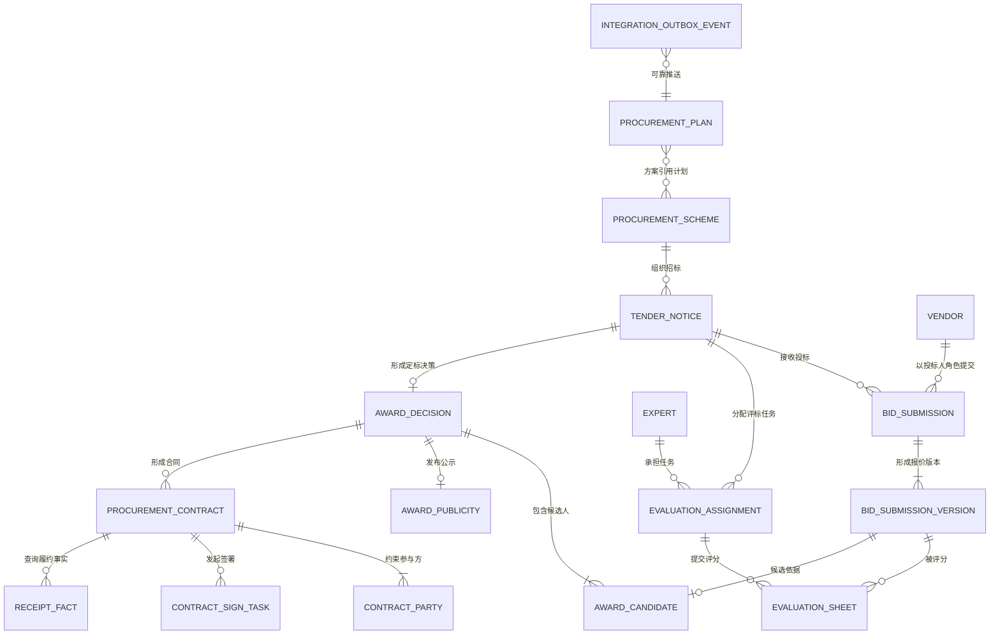

# 招采系统重构落地检查与后续设计

更新日期：2026-09-23

## 1. 结论

当前代码已建立“采购方案 -> 招标公告 -> 投标提交/版本 -> 评标任务/评标表 -> 定标决策/候选人/公示 -> 采购合同/参与方/签署任务 -> 履约事实”的主业务链。旧表、旧接口和历史数据均保留，新对象通过兼容服务增量同步，因此可以继续迭代，但尚不能直接删除旧模型。

本轮完成了代码级重构和迁移脚本，未连接或修改任何数据库。上线前必须先完成数据库一致性备份，再按本文第 7 节执行脚本、对账和灰度切换。

## 2. 对象分类清单

| 领域 | 现有业务对象 | 中文释义 | 定位 |
|---|---|---|---|
| 参与者 | `SysUser`、组织对象 | 招标人经办人、审批人 | 身份和权限主数据，不应按角色复制用户 |
| 参与者 | `Vendor` | 供应商/投标人 | 企业主数据，投标人是供应商在某次招标中的角色 |
| 参与者 | `Expert`、`BiddingEvaluatExpert` | 专家、旧专家评标关联 | 专家是主数据，参与某次评标由 `EvaluationAssignment` 表达 |
| 采购 | `ProcurementPlan` | 采购计划 | 描述采购需求、预算、经办信息和计划状态 |
| 采购 | `ContractPlanning`、`ContractPlanningSplit` | 合约规划、合约拆分 | 采购计划之前或之中的项目合约规划输入 |
| 采购 | `MaterialsList` | 采购清单 | 采购标的和数量价格明细 |
| 采购 | `ProcurementScheme` | 采购方案 | 组织招标活动的核心方案，关联一个或多个采购计划 |
| 招标 | `TenderNotice` | 招标公告/招标对象 | 承载招标范围、时间、方式和流程状态 |
| 投标 | `BidSubmission` | 投标提交 | 供应商针对一个公告的投标聚合根 |
| 投标 | `BidSubmissionVersion` | 投标版本 | 首次报价及每次调价的版本快照，保留前后版本链 |
| 评标 | `EvaluationAssignment` | 评标任务 | 专家在某次公告下承担的评标职责 |
| 评标 | `EvaluationSheet` | 评标表 | 专家对一个投标版本的商务、技术、报价评分及意见 |
| 定标 | `AwardDecision` | 定标决策 | 一次公告的定标聚合根和最终中选结论 |
| 定标 | `AwardCandidate` | 中标候选人 | 候选供应商、投标版本、排名和得分快照 |
| 定标 | `AwardPublicity` | 中标公示 | 公示内容、公示期间和发布状态 |
| 合同 | `ProcurementContract` | 采购合同 | 合同业务状态聚合根，可关联定标决策和旧合同 |
| 合同 | `ContractParty` | 合同参与方 | 甲方、供应商及其他合同主体 |
| 合同 | `ContractSignTask` | 合同签署任务 | 电子签章平台交互状态和回调幂等信息 |
| 履约 | `ReceiptPurchase` 等 `Receipt*` | 采购订单、收货、发票、对账、结算、台账事实 | 外部履约事实镜像，不是招采核心聚合根 |
| 集成 | `IntegrationOutboxEvent` | 集成事件发件箱 | 外部调用的可靠投递、重试、死信和审计载体 |

## 3. 核心对象关系

关键约束：

1. 用户、供应商、专家是主数据；招标人、投标人、评标专家是业务角色，不建立相互继承的用户子类。
2. 投标提交与投标版本是聚合与组成关系，一个提交必须至少形成一个版本。
3. 评分必须引用明确的投标版本，禁止直接对可变投标主记录评分。
4. 中标候选人是定标时的业务快照，不等同于供应商主数据。
5. 定标决策与合同是 1:N，允许分包、分批或补充签约。
6. `Receipt*` 仅记录履约事实，不允许反向覆盖采购、招标、定标和合同主状态。

## 4. 已落地矩阵

| 建议项 | 状态 | 落地内容 |
|---|---|---|
| 拆分投标主对象和调价记录 | 已完成 | `BidSubmission` + `BidSubmissionVersion`，旧投标保存路径双写 |
| 建立专家评标任务 | 已完成 | `BiddingEvaluatExpert` 保存后同步 `EvaluationAssignment` |
| 评分引用明确投标版本 | 已完成 | `ExpertScore` 保存后同步 `EvaluationSheet`，提交时计算总分 |
| 拆分定标、候选人和公示 | 已完成 | 新聚合已建立，旧定标写入同步，新查询优先读新模型并回退旧表 |
| 中标排行榜只读化 | 已完成 | 移除排行榜控制器的新增、修改、删除接口 |
| 建立合同聚合 | 已完成 | 合同、参与方、签署任务已拆分，旧合同保存和签章回调同步新模型 |
| 打通定标到合同关系 | 已完成 | 合同同步和历史迁移填充 `awardDecisionId`，关系调整为 1:N |
| Excel 导入对象与数据库实体分离 | 已完成 | 新增 `MaterialsListImportDTO`，旧 `MaterialsListExecl` 保留并弃用 |
| 集成日志隔离 | 已完成 | 业务服务改依赖 `IIntegrationCallLogService`，旧日志表仅作为适配器存储 |
| 外部推送可靠性 | 已完成 | Outbox 幂等、原子领取、指数退避、超时恢复、8 次死信、定时派发、人工重试 |
| 新领域查询权限 | 已完成 | 查询接口增加参数校验和 `bidding:domain:query` 权限 |
| 履约对象边界 | 已完成（代码约束） | `receipt.domain` 包级规则明确其为外部履约事实镜像 |
| 历史数据迁移与对账 | 已完成（脚本） | 提供招采、合同迁移及新旧对象对账 SQL，尚未在数据库执行 |
| 自动化验证 | 已完成（单元级） | 领域行为、合同首次同步、Outbox 成功和死信共 9 项测试通过 |

## 5. 部分落地和未执行事项

| 项目 | 当前状态 | 原因与后续动作 |
|---|---|---|
| 新模型成为唯一写模型 | 部分落地 | 当前采用旧表主写、新表兼容同步；完成生产对账和灰度验证后再反转主写方向 |
| 前端全面切换新查询接口 | 部分落地 | 后端已提供 `/bidding-domain`，需前端页面逐页切换并保留回退开关 |
| 履约查询端口物理隔离 | 未完成 | 已明确边界，后续应让合同域只依赖履约查询接口，不直接依赖 `Receipt*` Mapper |
| 第三方待办真实 HTTP 投递 | 外部阻塞 | `ThridPartyTodoTaskService.pushTask` 原实现仍是注释桩；需确认底层平台 URL、认证和响应成功规则后启用 |
| 数据库表和历史数据迁移 | 未执行 | 必须先备份目标数据库，再按第 7 节执行，当前只提交脚本 |
| 全量 Maven 构建 | 外部阻塞 | 私有签章依赖仓库不可用；已使用部署包依赖完成 Java 8 目标独立编译 |
| 集成/回归/压测 | 未执行 | 需要可用的 MySQL、Nacos、Redis、流程平台和签章测试环境 |
| 旧表和旧接口下线 | 不应立即执行 | 至少经历一个完整招采周期且对账无差异后再制定下线版本 |

## 6. Outbox 运行规则

- 状态：`PENDING(0)`、`PROCESSING(1)`、`PUBLISHED(2)`、`FAILED(3)`、`DEAD(4)`。
- 定时器默认启动 30 秒后运行，每 60 秒扫描一次，可通过 `integration.outbox.dispatch.*` 调整。
- 单条事件使用带原状态条件的更新领取，多实例不会同时投递同一事件。
- 失败按 2、4、8、16、32、60 分钟退避，最多 8 次后进入死信。
- 处理中超过 10 分钟会自动恢复为失败状态。
- 查询权限：`integration:outbox:query`；人工重试权限：`integration:outbox:retry`。
- 管理接口：`GET /integration/outbox`、`POST /integration/outbox/{eventId}/retry`。

## 7. 数据库上线顺序

1. 停止相关写入或进入可控维护窗口，完成 MySQL 一致性备份并验证可恢复。
2. 执行 `2026.09.22招采领域对象规范化.sql`。
3. 执行 `2026.09.23合同对象规范化.sql`。
4. 执行 `2026.09.23集成事件发件箱.sql`。
5. 执行 `2026.09.23招采历史对象迁移.sql`。
6. 执行 `2026.09.23合同历史对象迁移.sql`。
7. 执行 `2026.09.23招采新旧对象对账.sql`，保存对账结果并处理所有非预期差异。
8. 部署应用，验证旧接口、新查询接口、投标调价、专家评分、定标公示、合同签署回调和 Outbox 重试。
9. 灰度切换前端读路径；出现异常时只回退应用和读路径，不删除新表或历史数据。

## 8. 下一阶段优先级

1. 建立数据库备份并完成迁移、对账和测试环境部署，这是当前最高优先级。
2. 恢复第三方待办真实 HTTP 适配器，并以明确响应码作为 Outbox 成功依据。
3. 将合同域对履约域的访问收敛到只读查询端口，增加跨域契约测试。
4. 前端按投标、评标、定标、合同顺序切换到新查询模型，逐页验收。
5. 建立双写差异监控、Outbox 死信告警和业务指标，至少运行一个完整招采周期。
6. 对账稳定后，将新对象提升为主写模型，最后才评估旧字段和旧接口下线。
